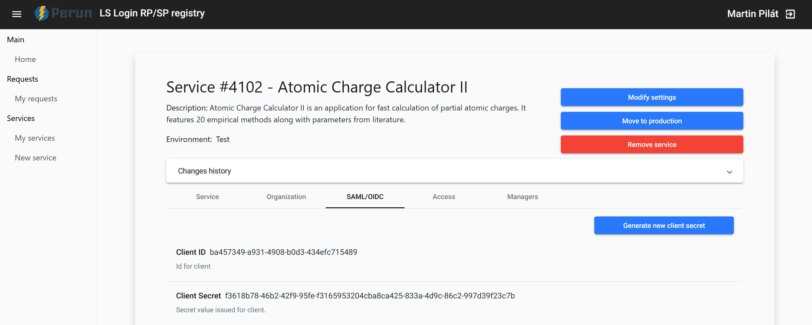
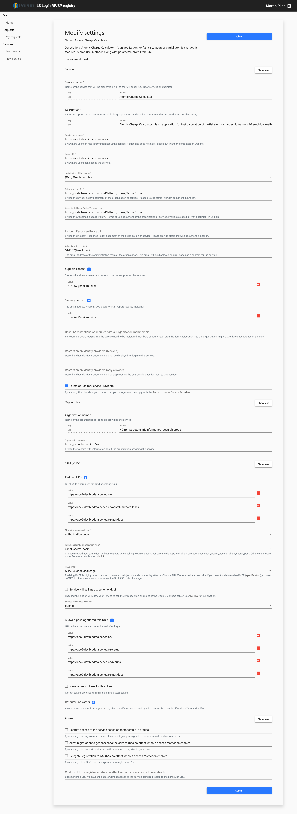

# Auth

Life Science Auth is implemented using the OpenID Connect protocol. You can read more [here](https://docs.google.com/document/d/17pNXM_psYOP5rWF302ObAJACsfYnEWhjvxAHzcjvfIE/edit?tab=t.0#heading=h.suudoy1bqtvm) and [here](https://lifescience-ri.eu/ls-login/documentation/service-provider-documentation/service-provider-documentation.html). 

API endpoints related to auth are implemented [here](../../../src/backend/app/api/v1/routes/auth.py) and a service used for fetching OIDC data is [here](../../../src/backend/app/services/oidc.py).

## Life Science AAI SP Registry
After the application was successfuly registered, you can set the  *Client ID* (`OIDC_CLIENT_ID`) and *Client Secret* (`OIDC_CLIENT_SECRET`) in the [.env file](../../../src/backend/app/.env). These values are located [here](https://services.aai.lifescience-ri.eu/spreg/auth) under the *My Services -> service name -> SAML/OIDC* section.

### Registry form
The following configuration was used for ACC II test registration:

